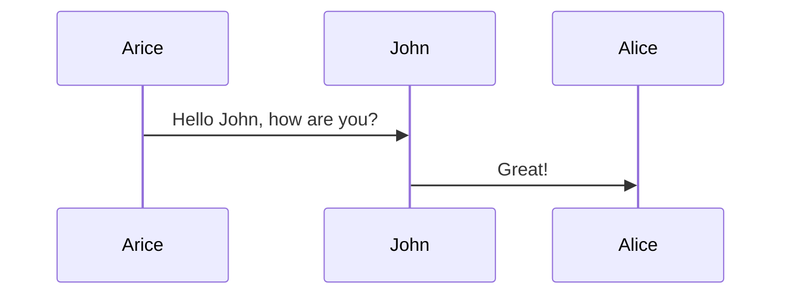
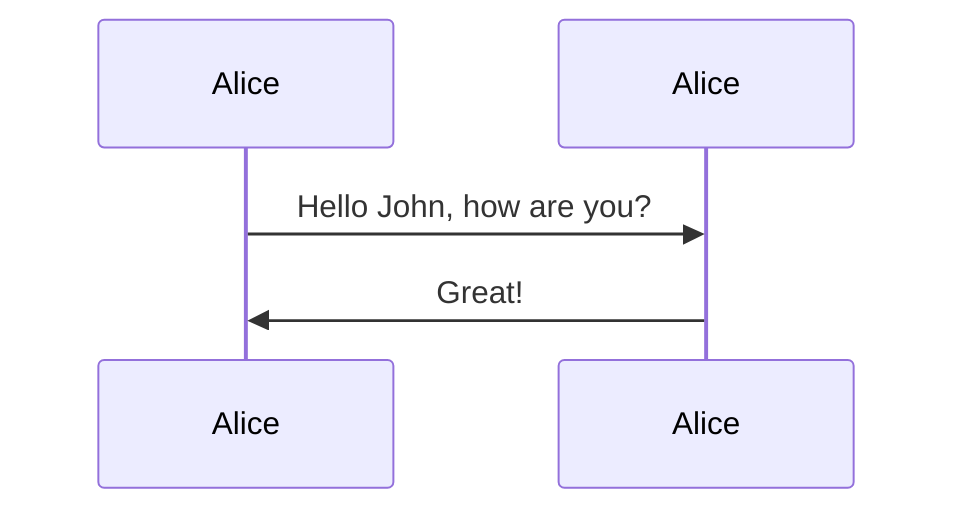
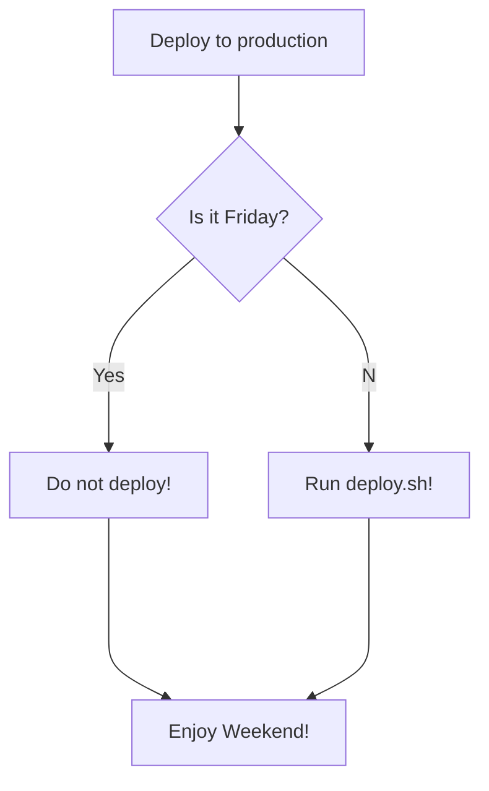

# This is Mermaid
## Sequence diagrams

```mermaid
sequenceDiagram
    Arice->>John: Hello John, how are you?
    John->>Alice: Great!
```

```mermaid
sequenceDiagram
participant A as Alice
participant B as Alice
    A->>B: Hello John, how are you?
    B->>A: Great!
```
## graph

```mermaid
graph TD;
    A-->B;
    A-->C;
    B-->D;
    C-->D;
```
## flowchart

```mermaid
flowchart TD;
    A[Deploy to production]-->B{Is it Friday?};
    B--Yes-->C[Do not deploy!];
    B--No-->D[Run deploy.sh!];
    C---->E[Enjoy Weekend!];
    D---->E[Enjoy Weekend!];
```
